# iCal4j Filters

In addition to a robust and compliant implementation of the iCalendar specification, it is also important to have
an expressive and powerful mechanism for accessing calendar data. iCal4j filters provide a framework for calendar
object retrieval whether it be in-memory object models or some other data source.

## Filter Expressions

Filter expressions serve to provide an abstract syntax tree (AST) for modeling an iCalendar filter that can be
used to filter data from various data sources.

### Unary Expression

A unary expression contains a single operand and operator, with the operand being another expression. Unary
expressions may be of prefix or postfix form:

* `<operator> <operand> # prefix unary expression, such as 'not something'`
* `<operand> <operator> # postfix expression, such as 'something exists'`

Some example unary expressions include:

* `not attendee = 'joeb@example.com' # events not including joeb` 
* `not due < startOfDay() # todos that are not overdue`
* `attendee[partstat:TENTATIVE] exists # events with tentative attendees`
* `attendee[role:CHAIR] not exists # events without a chair`

### Binary Expression

A binary expression include a left and right operand and and operator.

Some example binary expressions include:

* `attendee = 'job@example.com # events including joeb`
* `due < startOfDay() # todos that are overdue`

### Specification Expression

A specification expression represents an object specification, with a name, optional value and attributes.
For example, a specification representing a property would be a property name, (optional) property value and
a list of parameter attributes.

A specification match is defined as matching object name and the existence of the specified attributes. If a
value is supplied this must also match the object value.

_NOTE:_ The specification value is used to test object equivalence with unary expressions. For binary
expression matching the literal expression is used to provide a value.

### Literal Expression

A literal expression is the mechanism to supply a specification value for binary expressions. Supported literals
include String, Integer, Date, Collection and Function, which may be used with both comparison and value matching operators.

### Expression Operators

Operators are used in binary and unary expressions to specify expression behaviour.

#### Object Matching Operators

An object matching operator is used to test for existence of an object matching the specification. In addition
to the specification used in unary expressions, binary expressions also test for a literal value.

Object matching operators include:

* `equalTo` - a binary expression operator that matches object exactly on both specification and literal value
* `notEqualTo` - the negative of the `equalTo` operator
* `in` - a binary expression operator that matches exactly any object in the collection literal
* `notIn` - the negative of the `in` operator.
* `exists` - a unary expression operator that tests for the existence of the specified operand 
(only applicable for specification expression operands)
* `not exists` - the negative of the exists operator

#### Comparison Operators

Comparison operators include:

* `greaterThan`- a binary expression operator that matches object comparison greater than the supplied specification value
* `greaterThanEqual`a binary expression operator that matches object comparison greater than or equal to the supplied specification value
* `lessThan`a binary expression operator that matches object comparison less than the supplied specification value
* `lessThanEqual`a binary expression operator that matches object comparison less than or equal to the supplied specification value
* `between`a binary expression operator that matches object comparison greater than or equal to the first element in the supplied specification collection, and less than or equal to the second specification collection value

#### Value Matching Operators

Value matching operators include:

* `contains`a binary expression operator that matches object values that contain the supplied specification value string
* `matches`a binary expression operator that matches object values against the supplied specification regular expression

#### Logical Operators

Logical operators include:

* `and`a binary expression operator that returns the logical and of two expressions (not applicable for specification or literal expression operands)
* `or`a binary expression operator that returns the logical or of two expressions (not applicable for specification or literal expression operands)
* `not` - the negation of the operand expression (not applicable for specification or literal expression operands)

### Expression Parser

TBD.

## Component Filter

The ComponentFilter is an implementation of a PredicateFactory that is able to convert a filter expression
into a Predicate for iCal4j Components.

## Property Filter

The PropertyFilter is an implementation of a PredicateFactory that is able to convert a filter expression
into a Predicate for iCal4j Properties.
