# iCal4j Integration

iCal4j Integration provides support for popular calendar message transports and tooling.

## Overview

Whilst the iCal4j library provides support for parsing, validating and producing iCalendar data formats, typically a useful application will also need to integrate with messaging and other transports to support interoperability with external systems. 

Email is the most widely supported transport for calendaring systems, however this library also aims to support integration with other messaging tools and public APIs.

* Email - The official iCalendar message transport as defined by the iMiP RFC.
* Apache Camel - Support for iCalendar and vCard endpoints in Apache Camel
* AWS SNS, SQS, etc. - Cloud-native messaging support
* JMS - support for Java messaging

## Reactive Streams

iCal4j Integration includes support for [Reactive Streams](http://www.reactive-streams.org/), via the Java 9
implementation.

## Apache Camel

Added the ical4j-integration dependency to your project and configure your routes:

    from('ical:http://tzurl.org/zoneinfo/Australia/Melbourne')
    .to("mock:result")

## References

* [Project Home](http://github.com/ical4j/ical4j-integration/)
* [Javadocs](http://ical4j.github.io/docs/ical4j-integration/api/)
