# iCal4j Validation

iCal4j includes a comprehensive validation framework for checking compliance with the various iCalendar
specifications. This framework may also be used to implement custom validation rules to support data validation
for specific use-cases.

## Overview

The iCal4j Validation framework is based on the concept of apply a collection of validation rules to a target
iCalendar object and capturing the results of these rules.

### Validation Rule

A validation rule defines a set of constraints to apply when validating a target, and reporting constructs if
the target does not meet those constraints.

* Validation Type - collection or predicate-based check of target, including a description used for reporting
* Instances - zero or more inputs to validation checks
* Severity - reporting severity when a check fails (e.g. Warning, Error, etc.)

### Validation RuleSet

A rule set combines a group of rules and a context in which to apply them. You may have different rules for
Calendar properties, components, and properties nested within each component.

* Rules - a set of validation rules to apply to the context target
* Context - a target context provides an identifier for the target type used for reporting

### Validation Entry

A validation entry is used to report the result of a validation check, where validation rule requirements are
not met.

* Message - a message reporting the nature of the failure
* Severity - records the severity of the validation check failure
* Context - captures the context of the validation check

### Validation Result

A validation result collates validation entries from a target validation, which may include application of one
or more validation rule sets. Results may be used to summarise or take action based on the validation outcome.

* Entries - a list of validation entries resulting from a target validation
* ...

### Validator

A validator is a concrete implementation that encapsulates rule sets applied to a specific target type.

* Rule sets - a collection of rule sets to apply to the target
* ...

